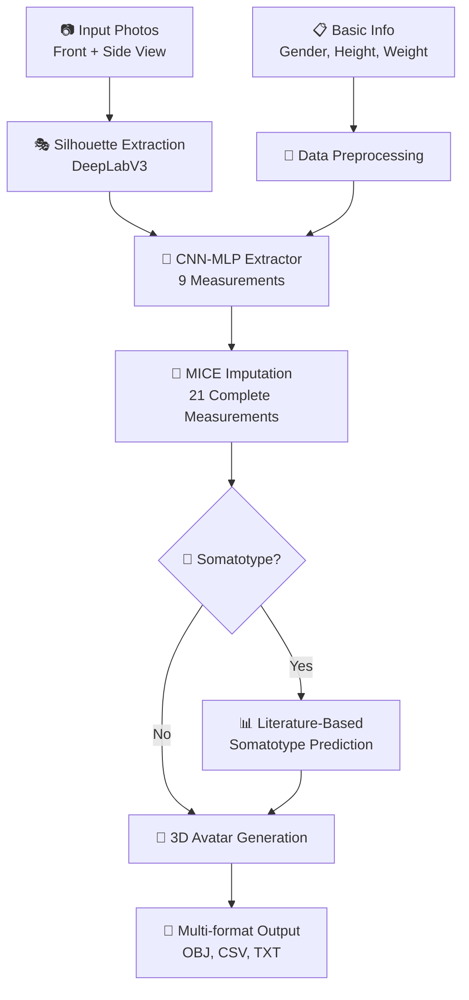

# Human Body Reshape DL Paper - Documentation

## Overview

This documentation provides comprehensive information about the Human Body Reshape Deep Learning system, which reconstructs 3D human avatars from 2D photographs and predicts specialized somatotype measurements using literature-based equations.

## 📁 Documentation Structure

### 📚 [Technical Documentation](./technical/)
In-depth technical analysis and implementation details for developers and researchers.

- **[🔍 Technical Review](./technical/review.md)** - Complete system overview, architecture, and technologies
- **[🧠 CNN Extractor](./technical/cnn.md)** - Neural network training documentation for measurement extraction
- **[🎯 Stage 1: Extractor](./technical/extractor101.md)** - Deep learning extractor technical analysis
- **[🔢 Stage 2: Imputation](./technical/impute101.md)** - MICE imputation system documentation
- **[🎨 Stage 3: Reshaper](./technical/reshaper.md)** - 3D avatar generation system

### 👥 [User Guides](./user-guides/)
Easy-to-follow guides for end users and quick setup instructions.

- **[ℹ️ System Overview](./user-guides/info101.md)** - User-friendly introduction to the system

### 🧬 [Somatotype System](./somatotype/)
Advanced body composition analysis using specialized anthropometric measurements.

- **[🔬 Somatotype Integration](./somatotype/SOMATOTYPE_INTEGRATION.md)** - System integration and usage guide
- **[📊 Implementation Summary](./somatotype/SOMATOTYPE_IMPLEMENTATION_SUMMARY.md)** - Complete implementation details
- **[📋 Somatotype Analysis](./somatotype/somatotype.md)** - CAESAR dataset integration strategy
- **[📖 Literature Integration](./somatotype/LITERATURE_INTEGRATION_SUMMARY.md)** - Literature-based prediction equations

### 🗃️ [Archives](./archives/)
Historical and deprecated documentation files.

- **[📄 Empty Documentation Files](./archives/)** - Placeholder files and deprecated content

---

## 🚀 Quick Start

### System Requirements
- Python 3.8+
- CUDA-compatible GPU (optional, system falls back to CPU)
- 8GB+ RAM recommended

### Basic Usage

#### 1. Standard 3D Avatar Generation
```bash
# Place input images: input_front.png, input_side.png in data/input_files/
# Place input info: input_info.csv in data/input_files/
python src/photos2avatar.py
```

#### 2. Advanced Somatotype Analysis
```bash
# Generate 3D avatar + somatotype measurements with literature-based predictions
python src/photos2somatotype.py
```

### Output Files
- **3D Avatar**: `.obj` files compatible with Blender, Maya, etc.
- **Measurements**: `.csv` files with detailed anthropometric data
- **Reports**: Human-readable summaries and confidence analysis

---

## 🎯 Key Features

### Core Capabilities
- ✅ **3D Avatar Generation** from 2D photos
- ✅ **21+ Anthropometric Measurements** extraction
- ✅ **8 Specialized Somatotype Measurements** prediction
- ✅ **Literature-Based Equations** (Jackson-Pollock, Durnin-Womersley, etc.)
- ✅ **MICE Statistical Imputation** for missing measurements
- ✅ **Confidence Scoring** and validation
- ✅ **Multi-format Output** (OBJ, CSV, TXT)

### Technical Highlights
- **Hybrid CNN-MLP Architecture** for measurement extraction
- **DeepLabV3 Segmentation** for automatic silhouette extraction  
- **Statistical Shape Models** for realistic 3D synthesis
- **Multi-dataset Training** (ANSUR I/II, SPRING, CAESAR)
- **GPU/CPU Adaptive** processing

---

## 📖 Academic Reference

If you use this system in your research, please cite:

```bibtex
@article{curbelo2024human,
    title={A methodology for realistic human shape reconstruction from 2D images},
    author={Curbelo, J.P. and Spiteri, R.J.},
    journal={Multimedia Tools and Applications},
    year={2024},
    doi={https://doi.org/10.1007/s11042-023-17947-6}
}
```

---

## 🔄 System Workflow



---

## 🤝 Support & Contribution

For technical questions, implementation details, or contributions, please refer to the specific technical documentation in each section above.

### Navigation Tips
- 📚 **New Users**: Start with [User Guides](./user-guides/info101.md)
- 🔧 **Developers**: Explore [Technical Documentation](./technical/review.md)
- 🧬 **Body Composition Research**: See [Somatotype System](./somatotype/SOMATOTYPE_INTEGRATION.md)
- 📊 **Academic Research**: Review the complete [Technical Review](./technical/review.md)

---

*Last Updated: September 16, 2025*
*Documentation Version: 2.1.0*