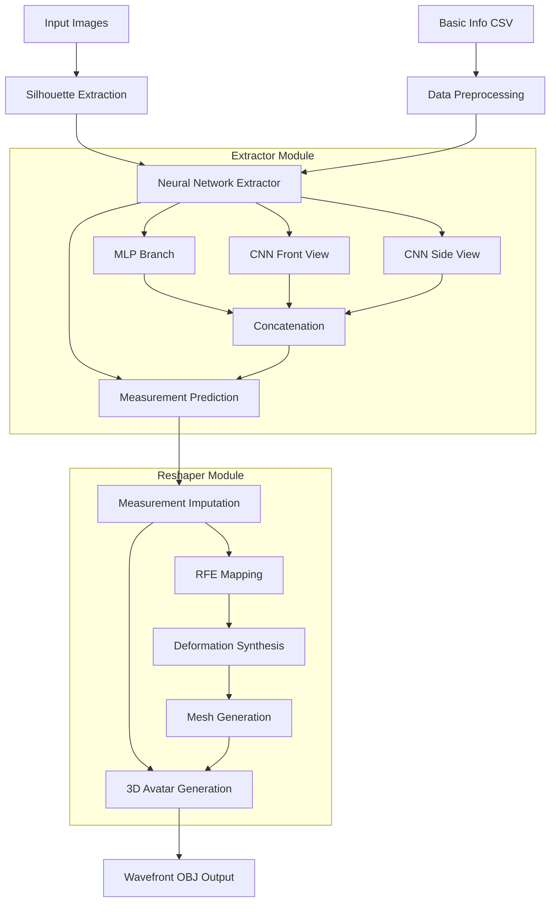

# Human Body Reshape Deep Learning Project - Technical Review

## 1. Overview

### Project Purpose
This project implements a **deep learning-based methodology for realistic human shape reconstruction from 2D images**. The system takes two photographs (front and side views) along with basic anthropometric data (gender, height, weight) and generates accurate 3D human avatars in Wavefront OBJ format.

### Core Problem Domain
- **Computer Vision & 3D Modeling**: Converting 2D image data into accurate 3D human body representations
- **Anthropometric Measurement Extraction**: Using machine learning to predict 21 body measurements from visual data
- **Statistical Shape Modeling**: Employing deformation-based mapping to synthesize realistic 3D human meshes

### Primary Audience
- **Researchers** in computer vision, anthropometry, and human body modeling
- **Developers** working on virtual try-on, fitness applications, or avatar creation systems
- **Academic institutions** studying human body shape analysis and reconstruction

## 2. Repository Structure

```
human-body-reshape-DL-paper/
├── data/                           # All data files and models
│   ├── body_reshaper_files/        # Pre-trained reshaper model files
│   ├── cp_blender_files/           # Control point definitions (*.obj, *.png)
│   ├── datasets/                   # ANSUR I/II and SPRING measurement datasets
│   ├── input_files/                # User input images and info
│   ├── model_files/                # Trained neural network models
│   └── output_files/               # Generated avatars and results
├── figures/                        # Paper figures and visualizations
├── src/                           # Source code
│   ├── datasets/                   # Dataset processing utilities
│   ├── extractor/                  # Neural network for measurement extraction
│   ├── reshaper/                   # 3D avatar generation engine
│   ├── paper_scripts/              # Research validation scripts
│   ├── photos2avatar.py            # Main pipeline orchestrator
│   └── utils.py                    # Shared constants and utilities
├── requirements.txt                # Python dependencies
└── README.md                      # Setup and usage instructions
```

### Design Rationale
The structure follows a **clear separation of concerns**:
- **Data isolation**: All datasets, models, and outputs in dedicated `data/` folder
- **Modular architecture**: Distinct modules for extraction (`extractor/`) and reshaping (`reshaper/`)
- **Pipeline orchestration**: Single entry point (`photos2avatar.py`) that coordinates the entire workflow
- **Research reproducibility**: Separate `paper_scripts/` for validation and benchmarking

## 3. Key Technologies & Dependencies

### Core Technologies
| Component | Technology Stack |
|-----------|------------------|
| **Deep Learning Framework** | TensorFlow 2.13.0, Keras |
| **Computer Vision** | OpenCV 4.8.0, scikit-image 0.21.0, PyTorch (torchvision 0.15.2) |
| **Scientific Computing** | NumPy 1.24.3, SciPy 1.11.1, pandas 2.0.3 |
| **3D Processing** | Custom mesh processing with sparse matrix operations |
| **Machine Learning** | scikit-learn 1.3.0 for preprocessing and imputation |

### External Services & Models
- **DeepLab v3**: Pre-trained semantic segmentation model for silhouette extraction
- **ANSUR Datasets**: Military anthropometric databases (ANSUR I, II)
- **SPRING Dataset**: Additional body measurement database
- **3D Human Body Shape Templates**: Based on statistical shape models

### Configuration Files
- `requirements.txt`: Python package dependencies
- `utils.py`: Global configuration constants (paths, measurements, scaling parameters)
- Control point files in `data/cp_blender_files/`: Define anatomical measurement locations

### Environment Variables
- **GPU Support**: Automatic CUDA detection with CPU fallback
- **File Encoding**: ISO-8859-1 for dataset compatibility
- **Model Paths**: Configurable through `utils.py` constants

## 4. High-Level Architecture

### System Components



### Data Flow
1. **Input Processing**: Images undergo semantic segmentation to extract silhouettes
2. **Feature Extraction**: Combined MLP+CNN architecture processes numerical data and image pairs
3. **Measurement Prediction**: Neural network outputs 8 key body measurements
4. **Data Completion**: Iterative imputation fills missing measurements to complete 21-measurement vector
5. **3D Synthesis**: RFE (Recursive Feature Elimination) matrices map measurements to vertex deformations
6. **Mesh Generation**: Deformation-based synthesis creates final 3D avatar with proper topology

## 5. Core Workflows & Execution Paths

### Workflow 1: Complete Avatar Generation Pipeline

**Entry Point**: `src/photos2avatar.py`

**Execution Path**:
```python
def main():
    # [1] Load and preprocess input data
    basic_info, input_images, df_total = get_input_data()
    
    # [2] Extract silhouettes using DeepLab
    silhouettes = extract_silhouette(input_images)
    
    # [3] Predict measurements using neural network
    model = load_model("extractor_nn_model.h5")
    measurements = measurements_from_sil(model, basic_info, silhouettes, df_total, stature)
    
    # [4] Generate 3D avatar
    avatar = Avatar(measurements, gender)
    avatar.predict()  # Impute missing measurements
    avatar.create_obj_file()  # Generate 3D mesh
    avatar.measure()  # Validate output measurements
```

**Key Functions**:
- `extract_silhouette()`: Applies pre-trained DeepLab v3 for semantic segmentation
- `measurements_from_sil()`: Runs test-time augmentation and neural network inference
- `Avatar.predict()`: Uses IterativeImputer with LinearRegression for missing data
- `Avatar.create_obj_file()`: Performs RFE mapping and deformation synthesis

### Workflow 2: Neural Network Training

**Entry Point**: `src/extractor/extractor_model_training.py`

**Execution Path**:
```python
def main():
    # Load datasets (ANSUR I/II, SPRING)
    df_total = load_databases()
    imgX_front, imgX_side = load_images()
    
    # Create train/test split
    train_test_split(df_total, imgX_front, imgX_side)
    
    # Build hybrid architecture
    MLP_model = createMLP_model(in_MLPlayers=2)
    CNN_model = createCNN_model(in_CNNlayers=1, in_DENSElayers=0)
    Combined_model = createCombined_model(MLP_model, CNN_model)
    
    # Train with data augmentation
    Combined_model.fit(training_data_gen, validation_data=validation_data_gen)
```

**Architecture Details**:
- **MLP Branch**: Processes gender + height (2 inputs) → 16 → 64 → 64 → 8 outputs
- **CNN Branch**: AlexNet-inspired architecture (96→128→64 conv layers + dense layers)
- **Fusion**: Concatenates MLP + 2×CNN outputs, final dense layer produces 8 measurements

### Workflow 3: 3D Model Training (Reshaper)

**Entry Point**: `src/reshaper/trainer.py`

**Execution Path**:
```python
def main():
    # Process control points and facet definitions
    convert_cp(gender)
    convert_template()
    
    # Load 3D mesh database
    vertices = obj2npy(gender)
    
    # Calculate measurement mappings
    calculate_measurements(vertices, facets, cp)
    
    # Train RFE matrices
    train_rfe_matrices(measurements, vertices)
    
    # Generate deformation mappings
    load_def_data(vertices, facets)
```

## 6. Deep Dive into Critical Modules

### 6.1 Avatar Class (`src/reshaper/avatar.py`)

**Responsibility**: Core 3D avatar generation engine

**Key Methods**:
```python
class Avatar:
    def predict(self, db_name="TOTAL"):
        """Imputes missing measurements using IterativeImputer"""
        # Uses LinearRegression with 20 nearest features
        # Applies StandardScaler normalization
        
    def create_obj_file(self, ava_dir, ava_name):
        """Generates 3D mesh from measurements"""
        vertices = self.mapping_rfemat()  # RFE-based deformation
        normals = self.compute_normals(vertices, facets)
        # Writes Wavefront OBJ file with vertices, normals, faces
        
    def mapping_rfemat(self):
        """Maps measurements to vertex deformations"""
        # Loads pre-trained RFE masks and matrices
        # Performs sparse matrix operations for deformation
        
    def d_synthesize(self, deform):
        """Synthesizes body from deformation parameters"""
        # Solves sparse linear system: def2vert^T * def2vert * x = def2vert^T * d
        # Uses scipy.sparse.linalg.splu for efficient computation
```

**Design Decisions**:
- **Sparse Matrix Operations**: Uses SciPy's sparse matrices for memory efficiency with 12,500 vertices
- **Iterative Imputation**: Handles missing measurements robustly using multi-variate approach
- **Modular Design**: Separates deformation computation from mesh generation for flexibility

### 6.2 Neural Network Extractor (`src/extractor/extractor_model_training.py`)

**Responsibility**: Extracts body measurements from silhouette images

**Architecture Implementation**:
```python
def createCombined_model(MLP_model, CNN_model):
    input_numca = Input(shape=INP_SHAPE, name="input_numca")      # Gender + height
    input_front = Input((224, 224, 1), name="input_front")       # Front silhouette
    input_side = Input((224, 224, 1), name="input_side")         # Side silhouette
    
    output_numca = MLP_model(input_numca)
    output_front = CNN_model(input_front)
    output_side = CNN_model(input_side)
    
    # Fusion layer
    combinedInput = concatenate([output_numca, output_front, output_side])
    combined_hidden = Dense(16, activation="relu")(combinedInput)  # 8*2 = 16 nodes
    combinedOutput = Dense(8, activation="linear")(combined_hidden)
```

**Training Strategy**:
- **Data Augmentation**: Zoom (0.8-1.2), width/height shifts, shear transformations
- **Test-Time Augmentation**: 20 augmented predictions averaged for final result
- **Loss Function**: Mean Squared Error with Mean Absolute Error monitoring
- **Regularization**: Dropout (0.3, 0.5) and early stopping (patience=10)

**Performance Optimizations**:
- **Weight Sharing**: Same CNN processes both front and side views
- **Batch Processing**: Custom generator handles multi-input data efficiently
- **GPU Acceleration**: Automatic CUDA detection with graceful CPU fallback

### 6.3 Main Pipeline Orchestrator (`src/photos2avatar.py`)

**Responsibility**: Coordinates entire image-to-avatar workflow

**Critical Workflow Steps**:
```python
def main():
    # Step 1: Input processing with validation
    basic_info, input_images, df_total = get_input_data()
    
    # Step 2: Semantic segmentation
    silhouettes = extract_silhouette(input_images)  # Uses DeepLab v3
    
    # Step 3: Measurement extraction with TTA
    measurements = measurements_from_sil(model, basic_info, silhouettes, df_total, stature)
    
    # Step 4: 3D avatar synthesis
    measurements_21 = create_measurements_array(measurements, weight)
    avatar = Avatar(measurements_21, gender)
    avatar.predict()  # Complete missing measurements
    avatar.create_obj_file()  # Generate 3D mesh
```

**Error Handling & Robustness**:
- **Model Loading**: Graceful handling of missing model files
- **Input Validation**: Checks for correct image dimensions and file formats
- **Memory Management**: Explicit garbage collection for large datasets
- **File I/O**: Comprehensive exception handling for data loading operations

### 6.4 Measurement Mapping System (`src/reshaper/trainer.py`)

**Responsibility**: Trains mapping from measurements to 3D deformations

**Core Algorithm**:
```python
def calculate_weights(cp, vertices, facets, label):
    """Calculates volume-based weights for body measurements"""
    for i in range(vertex_count):
        # Calculate tetrahedron volume using scalar triple product
        vol = sum(np.cross(v1, v2).dot(v3) for each face)
        vol = abs(vol) / 6.0
        
        # Convert volume to weight using human body density
        weights[0, i] = 1026.0 * vol  # kg/m³ (3DHBSh standard)
        weights[1, i] = 1010.0 * vol  # Alternative density
```

**RFE Matrix Training**:
```python
def train_rfe_matrices():
    """Trains Recursive Feature Elimination mappings"""
    # For each facial element (25,000 faces):
    #   - Select relevant measurements using RFE
    #   - Train linear regression mapping
    #   - Store mask and coefficient matrix
```

**Design Trade-offs**:
- **Memory vs. Accuracy**: Dense vertex representation (12,500 vertices) for high fidelity
- **Computation vs. Quality**: RFE per face element for fine-grained control
- **Storage vs. Speed**: Pre-computed matrices enable fast inference

### 6.5 Control Point Handler (`src/reshaper/cp_handler.py`)

**Responsibility**: Manages anatomical measurement definitions

**Measurement Categories** (from `utils.py`):
```python
MEAS_LABELS = {
    'stature_cm': 1,           # Vertical length
    'chest_girth': 2,          # Horizontal girth  
    'shoulder_length': 3,      # Point-to-point length
    'neck_base_girth': 4,      # Point-to-point girth
    # ... 21 total measurements
}
```

**Measurement Calculation**:
```python
def calc_measurements(self, cp, facet):
    """Extracts measurements from 3D mesh using control points"""
    # Volume calculation for weight
    vol = sum(scalar_triple_product(face_vertices) for each face) / 6.0
    weight = KHUMANBODY_DENSITY * vol
    
    # Distance/circumference calculations for other measurements
    for measurement in MEASUREMENTS[1:]:
        length = self.calc_length(MEAS_LABELS[measurement], cp[i], measurement)
```

## 7. Documentation & Comments Review

### Existing Documentation Quality

**Strong Areas**:
- **README.md**: Comprehensive setup instructions with clear folder structure diagrams
- **Method Docstrings**: Most critical functions have detailed parameter descriptions
- **Academic Context**: Links to published paper for theoretical background
- **Installation Guide**: Step-by-step virtual environment setup with dependency management

**Documentation Gaps**:
- **Algorithm Explanations**: Limited inline comments explaining mathematical operations
- **Model Architecture Rationale**: CNN/MLP design choices not well documented
- **Parameter Tuning**: No guidance on hyperparameter selection or modification
- **Troubleshooting**: Error handling explanations could be more detailed

### Code Comment Analysis

**Well-Commented Sections**:
```python
# Excellent mathematical documentation
def d_synthesize(self, deform):
    """Synthesizes a body by deform-based mapping"""
    # Solves: def2vert.transpose().dot(def2vert) * x = def2vert.transpose().dot(d)
    LU = sp.sparse.linalg.splu(def2vert.transpose().dot(def2vert).tocsc())
```

**Areas Needing Improvement**:
- Neural network architecture choices lack justification comments
- RFE matrix computation steps need more detailed explanations
- Control point definition rationale could be better documented

## 8. Setup & Run Instructions

### Prerequisites
- **Python 3.8+** with pip package manager
- **GPU (Optional)**: CUDA-compatible GPU for accelerated training
- **Memory**: Minimum 8GB RAM (16GB recommended for full datasets)
- **Storage**: ~2GB for datasets and models

### Development Environment Setup

```powershell
# 1. Clone repository
git clone https://github.com/jpcurbelo/human-body-reshape-DL-paper.git
cd human-body-reshape-DL-paper

# 2. Create virtual environment
python -m venv venv
.\venv\Scripts\Activate

# 3. Install dependencies
pip install -r requirements.txt
```

### Data Setup

```powershell
# 4. Download datasets from Zenodo
# Place files in data/obj_files/ following structure:
# data/obj_files/obj_database_SPRING/{female,male}/
# data/obj_files/obj_database_ANSURI/{female,male}/
# data/obj_files/obj_database_ANSURII/{female,male}/
```

### Production Deployment (Avatar Generation Only)

```powershell
# 5. Prepare input files in data/input_files/:
#    - input_info_extractor.csv (gender, height, weight)
#    - input_front.png (front view image)
#    - input_side.png (side view image)

# 6. Generate avatar
cd src
python photos2avatar.py

# 7. Check output in data/output_files/
#    - avatar_{gender}_fromImg.obj (3D mesh)
#    - Silhouette images
```

### Development Workflow (Full Training)

```powershell
# Train Reshaper model (requires obj_files datasets)
cd src/reshaper
python trainer.py

# Train Extractor model (requires silhouette datasets)  
cd src/extractor
python extractor_model_training.py

# Generate avatar with custom models
cd src
python photos2avatar.py
```

### Common Gotchas
- **Model File Paths**: Ensure `extractor_nn_model.h5` exists in `data/model_files/`
- **Image Dimensions**: Input images automatically resized, but 448x448 recommended
- **Memory Usage**: Large datasets may require 16GB+ RAM during training
- **GPU Detection**: TensorFlow automatically uses GPU if available, CPU fallback otherwise

### Validation Commands

```powershell
# Test avatar generation with sample data
cd src/reshaper
python tests_temp.py

# Validate neural network performance
cd src/paper_scripts
python benchmark_tests.py
```

---

## Executive Summary

The **Human Body Reshape Deep Learning Project** represents a sophisticated computer vision system that transforms 2D photographs into accurate 3D human avatars. Built on a hybrid CNN+MLP neural architecture, the system extracts anthropometric measurements from front/side silhouettes and synthesizes realistic 3D meshes using deformation-based statistical modeling.

### Key Value Propositions

**Technical Innovation**:
- **Multi-modal Learning**: Combines visual and numerical data for robust measurement prediction
- **Statistical Shape Modeling**: Uses RFE-based deformation mapping for anatomically plausible results
- **Production-Ready Pipeline**: End-to-end automation from photos to 3D models

**Research Impact**:
- **Published Methodology**: Peer-reviewed approach with reproducible results
- **Comprehensive Datasets**: Leverages military anthropometric databases (ANSUR I/II, SPRING)
- **Open Source**: Fully accessible implementation for academic and commercial use

### Technical Risks & Limitations

**Model Dependencies**:
- Requires pre-trained models and datasets (~2GB) for optimal performance
- Training pipeline demands significant computational resources (GPU recommended)
- Limited to specific measurement set (21 anthropometric dimensions)

**Input Constraints**:
- Requires specific image format (front/side views with clear silhouettes)
- Performance dependent on image quality and pose standardization
- Gender-specific models may not generalize to all body types

### Business Applications

**Commercial Potential**:
- **Virtual Try-On**: Fashion and retail avatar generation
- **Fitness Tracking**: Body shape monitoring and analysis
- **Gaming/VR**: Realistic character creation systems
- **Medical Applications**: Anthropometric assessment tools

**Resource Requirements**:
- **Development**: Python expertise, computer vision knowledge
- **Deployment**: Standard server infrastructure, optional GPU acceleration
- **Maintenance**: Model retraining as datasets expand or requirements change

This project delivers a complete, research-validated solution for 3D human avatar generation with clear documentation, modular architecture, and proven academic foundations. The system balances theoretical rigor with practical deployment considerations, making it suitable for both research exploration and commercial application development.
